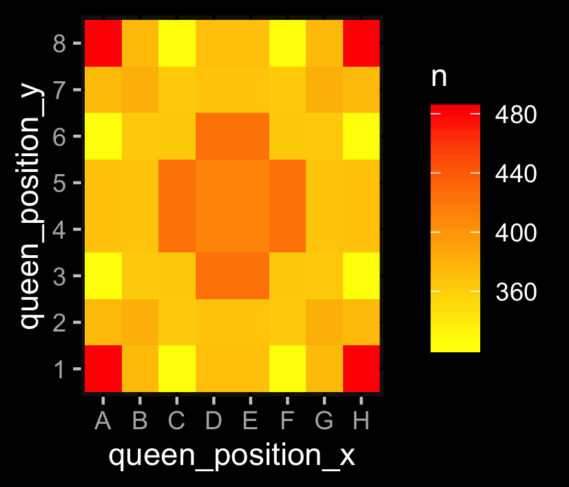

# String Of Queens

## Introduction

A couple of weeks ago, there was a puzzle [posted on Spiegel Online](https://www.spiegel.de/karriere/raetsel-der-woche-fuenf-damen-auf-einem-schachbrett-a-1285289.html): Arrange five queens on a chess board so that every field is threatened by at least one of them.

It's not too hard to find a solution to this puzzle. I was interested in finding _all_ solutions. Doing this turned out to require a lot of computing power. Working parallelized on four chips, it still took more than ten hours on my machine.

This repro contains a dataset of all possible solutions to the String of Queens puzzle, the code to produce it, and some analysis on the data.

*main.R* will guide you through the scripts.

*data/all_solutions.txt* contains just that.

It's 4860 possible solutions, by the way. [Some others](https://www.spiegel.de/karriere/fuenf-damen-raetsel-wie-spiegel-leser-es-geloest-haben-a-1286494.html) who solved the problem before me came up with the same number.

## How to go on

Ideas on how to do the task faster are appreciated. There are two possible ways of doing this: Making the testing algorithm more effective (I already improved it by 90% from my first draft), or finding a way to reduce all the combinations to check: I put the algorithm on every possible combination of five fields, that's 7.6 million.

Also, it would be highly interesting to look for clusters and patterns in the solutions. I have no idea how to tackle that.

## Good to know

If you want to find a solution to the puzzle by hand, where should you start? Number-crunching suggests it's best to start from one of the corners, as they are detected in more solutions than any other field on the board.

But every field is appearing in at least 323 different solutions. You also have plenty of choices for picking the second field: 98% percent of all two-field-combinations are part of at least one solution. Only 40 out of 2016 possible pairs are not.

## Contact

Reach out to @c_endt on Twitter or send a message to c.endt@sz.de.